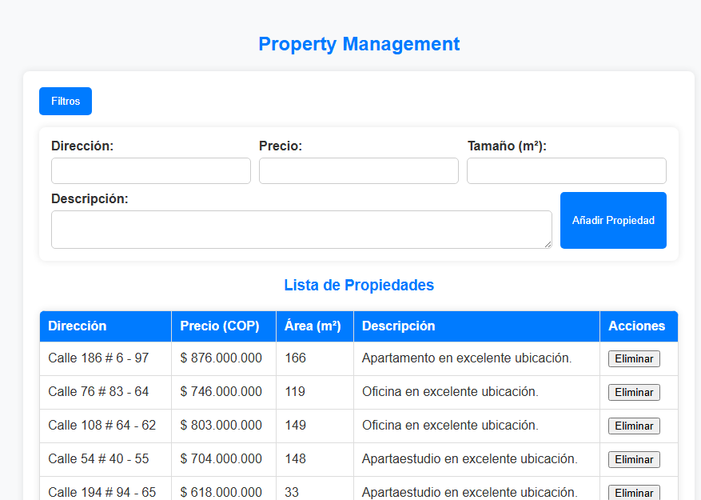

# 🏡 Property Management: Spring Boot REST API with MySQL and AWS Deployment

📌 **Property Management** is a web application built with **Spring Boot** that allows managing real estate properties. The application provides a **REST API** for property management and an interactive web interface. It is deployed on **AWS EC2** with a **MySQL** database in another EC2 instance, using **Docker** for containerization.

---

## ✨ Features

✅ **Full CRUD for properties** (Create, Read, Update, Delete).  
✅ **Advanced search with dynamic filters** (location, price, size).  
✅ **Pagination for property listing**.  
✅ **Success and error messages for user feedback**.  
✅ **Modern UI with collapsible filter sidebar**.  
✅ **Deployed on AWS EC2 with Docker and MySQL**.  
✅ **Custom Java annotations for controllers** (`@RestController`, `@GetMapping`, `@RequestParam`).

---

## 🚀 Setup and Execution

### 🛠 Prerequisites

🔹 **Java 17+**  
🔹 **Maven**  
🔹 **Docker**  
🔹 **MySQL 8+**  
🔹 **AWS EC2 instances (one for the application, another for the database)**

---

### 📥 Local Installation and deployment with Docker

1️⃣ **Clone the repository**
```sh
git clone https://github.com/Sguerra1702/AREP-taller05
cd AREP-taller05
```


3️⃣ **Configure `application.properties`**  
Modify `src/main/resources/application.properties` to connect to your database:
```properties
spring.datasource.url=jdbc:mysql://EC2_DB_INSTANCE:3306/property_db
spring.datasource.username=root
spring.datasource.password=raven
spring.jpa.hibernate.ddl-auto=update
```

4️⃣ **compile the project**
```sh
mvn clean install
```


1️⃣ **Build the Docker image**
```sh
docker build -t property-management .
```

2️⃣ **Run the Docker container on AWS**
```sh
docker run -d -p 42000:8080 --name newspringwebcontainer sneplatte/newspringmanager
```

3️⃣ **Access the application**  
From a browser:
```
http://localhost:42000
```

📌 **Test the REST API**
```sh
curl -X GET http://localhost:42000/properties
```

---

## 📂 Project Structure

```
property-management/
├── src/
│   ├── main/
│   │   ├── java/edu/eci/arep/CRUD_API/
│   │   │   ├── CrudApiApplication.java  # Main entry point
│   │   │   ├── controller/
│   │   │   │   ├── PropertyController.java         # REST Controller
│   │   │   ├── model/
│   │   │   │   ├── Property.java                   # JPA Entity
│   │   │   ├── repository/
│   │   │   │   ├── PropertyRepository.java         # JPA Repository
│   │   │   ├── service/
│   │   │   │   ├── PropertyService.java            # Business logic
│   ├── resources/
│   │   ├── static/
│   │   │   ├── index.html                                  # User interface
│   │   │   ├── css/styles.css                              # Styles
│   │   │   ├── js/app.js                                   # Frontend logic
│   │   ├── application.properties              # Spring Boot config
├── Dockerfile                                      # Docker config
├── README.md                                       # Documentation
```

---

## 🔥 REST API

### 📌 Available Endpoints

| 🌍 **Endpoint**       | 🔄 **Method** | 📥 **Parameters**           | 📋 **Description**                     |
|---------------------|-------------|--------------------------|-------------------------------------|
| `/properties`      | **GET**     | None                     | List all properties               |
| `/properties/{id}` | **GET**     | Path variable: `id`       | Get property by ID                |
| `/properties/create` | **POST**  | JSON `{address, price, size, description}` | Create a new property |
| `/properties/{id}` | **PUT** | JSON with updated fields | Update an existing property |
| `/properties/{id}` | **DELETE** | Path variable: `id` | Delete a property |
| `/properties/busqueda` | **GET** | Query parameters: `address`, `minPrice`, `maxPrice`, `minSize` | Search properties with filters |
| `/properties/generate` | **POST** | None | Generate 100 sample properties |
| `/properties/deleteAll` | **DELETE** | None | Delete all properties |

📌 **Example Request**
```sh
curl -X POST http://localhost:42000/properties/create \
     -H "Content-Type: application/json" \
     -d '{"address": "Calle 123", "price": 500000000, "size": 120, "description": "Beautiful house"}'
```

📌 **Example Response**
```json
{
  "id": 1,
  "address": "Calle 123",
  "price": 500000000,
  "size": 120,
  "description": "Beautiful house"
}
```

---

## 🎨 Web Interface

The web interface allows:  
✅ **Adding new properties**  
✅ **Viewing paginated property listings**  
✅ **Filtering by address, price, and size**  
✅ **Deleting properties**

📌 **Screenshot**  


---

## 🌐 Deployment on AWS

1️⃣ **Create two EC2 instances**:
- **App Server**: Runs the Spring Boot app inside Docker.
- **DB Server**: Runs MySQL.

2️⃣ **Set up MySQL on the database instance with another docker container**
   ```sh
   docker pull mysql
   docker run --name db-spring-propertymanager -e MYSQL_ROOT_PASSWORD=raven -p 3306:3306 -d mysql
   ```

3️⃣**On the App Server EC2 instance, Run the Docker container on AWS**
```sh
docker run -d -p 42000:8080 --name newspringwebcontainer sneplatte/newspringmanager
```

3️⃣ **Access the application**  
From a browser:
```
http://EC2-Instance-DNS-Address:42000
```

---

## **👨‍💻 Author**
📌 Developed by **[Your Name]**.

🔹 GitHub: [YourGitHub](https://github.com/Sguerra1702)  
🔹 Email: santiago.guerra@mail.escuelaing.edu.co

